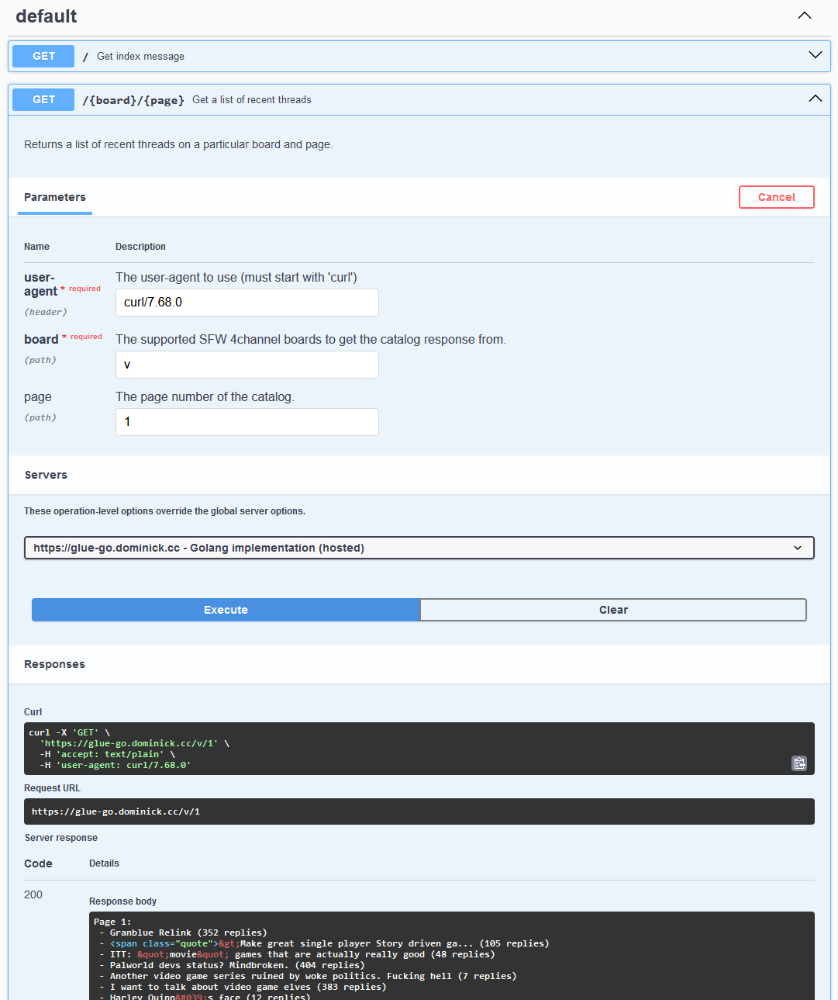

# glue <!-- omit in toc -->

This is a trivial app implemented in multiple languages. This service returns a plaintext response showing the active threads in some 4channel discussion boards using [their read-only API](https://github.com/4chan/4chan-API). 

```sh
# Summarize page 5 of Papercraft & Origami (/po/)
curl https://glue-go.dominick.cc/po/5
```
```txt
Page 5: 
 - several pieces. (1 replies)
 - Cybermodels Quake Marine (5 replies)
 - pepakura wisdom (6 replies)
 - Lucky Stars (52 replies)
 - Son of the mask paper craft (4 replies)
 - dirk eisner&#039;s di-excavated octahedron (2 replies)
 - solicitud libro origami pdf, Origami Land- por Tomoko Fuse (202 replies)
 - I&#039;m making a paper gauntlet. My grandmother threw out the o... (16 replies)
 - Please share (34 replies)
 - Hi, I&#039;m looking for this papercraft: (12 replies)
 - Anybody got the files for this Onihime? (4 replies)
 - Printable Origami Paper Patterns (67 replies)
 - hehe, le funny mustache man (20 replies)
 - Looking for for Paper Robots: 25 Fantastic Robots You Can Build ... (2 replies)
 - help with model &amp; general FF bread ig (9 replies)
```

## Table of contents <!-- omit in toc -->
- [Purpose](#purpose)
- [What's done vs a work in progress](#whats-done-vs-a-work-in-progress)
- [Deployment](#deployment)
  - [Observability](#observability)
- [Testing](#testing)
- [API Documentation](#api-documentation)


## Purpose
This is a very simple application that could just exist as a [jq](https://jqlang.github.io/jq/) one-liner. For example:
```sh
# Summarize page 5 of Papercraft & Origami (/po/)
curl -s https://a.4cdn.org/po/catalog.json | \
jq -r '.[] | select(.page == 5) | .threads[] |
  " - " + (if .sub == null then .com[:64] else .sub end) +
  " (\(.replies))"'
```

But what this application actually does is not the really point. Most of the code I've worked on for the past 7 years is not visible to a prospective employer. The purpose of this repo is to demonstrate my ability to:
- write readable code and create services in multiple languages
- containerize applications using best practices
- provide development containers to facilitate developing "on-container"
- integrate with third-party APIs
- write integration tests and mock out dependencies
- build load/performance tests
- implement metrics and API monitoring
- document a project and an API
- use CICD and deploy this app somewhere

## What's done vs a work in progress
I still plan to do a few things to this project. This table shows what's available now.

|Requirements/Features|Python<br>Implementation|Go<br>Implementation|Javascript<br>Implementation|
|---|---|---|---|
|Get boards API|☑️|☑️|☑️|
|Access logs|☑️|☑️|☑️|
|HTML response for non-curl users|☑️|☑️|☑️|
|Timeouts for fanout|☑️|☑️|☑️|
|Functional tests (passing)|☑️|☑️|☑️|
|Unit tests (passing)|🔲|🔲|🔲|
|Performance tests (passing)|🔲|🔲|🔲|
|Cloud deployment|☑️|☑️|☑️|
|CICD to build/push Docker image|☑️|☑️|☑️|
|CORS headers for swagger-ui|☑️|☑️|☑️|
|Prometheus metrics|☑️|☑️|☑️|
|API monitoring|☑️|☑️|☑️|

## Deployment
I have an instance of each implementation deployed to my Oracle Cloud Infrastructure (OCI) tenancy. 

```sh
curl https://glue-go.dominick.cc/g      # go
curl https://glue-py.dominick.cc/po/2   # python
curl https://glue-js.dominick.cc/mu     # javascript
```

For those curious, this repo using GitHub Actions to publish [packages](https://github.com/dominickp?tab=packages&repo_name=glue) (the docker images of the applications) to GitHub Container Registry (GHCR) with tag `main` (named after the branch). I'm deploying containers in OCI with [Portainer](https://www.portainer.io/) which pulls prebuilt images from GHCR. I also have a [Watchtower](https://containrrr.dev/watchtower/) container which scans for updates the images in GHCR at the `main` tag, and if detected, will automatically pull and re-deploy the containers. 


Another alternative would be to have GitHub Actions deploy to Portainer directly, which would give me a much more normal CICD pipeline. I didn't do this because currently my Portainer instance is only accessible via my [Tailscale](https://tailscale.com/) network and I'd have to expose it to the Internet to allow GitHub Actions access it. But I'm sure I could whitelist GitHub to access it with network policies.

### Observability
See [./docs/observability.md](./docs/observability.md).

## Testing
See [./docs/testing.md](./docs/testing.md)

## API Documentation
This application defines a simple plaintext API (but also has some errors in HTML in cases where the user accesses via the browser). This is defined in [the included OpenAPI spec](./schema/swagger.yml).

You can run the included `swagger-ui` to see the API docs:

```sh
docker-compose up swagger-ui
```

Then navigate to [http://localhost:9001/](http://localhost:9001/) to view it.

I've configured the following sets of servers in swagger-ui:
- deployed services
- local mocked containers
- local live container

Here is a screenshot of it in action:


