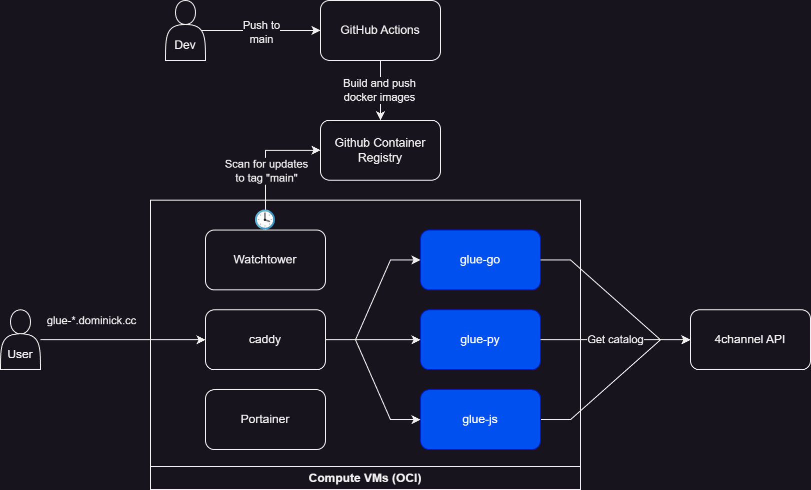

# glue <!-- omit in toc -->

This is a trivial app implemented in multiple languages. This service returns a plaintext response showing the active threads in some 4channel discussion boards using [their read-only API](https://github.com/4chan/4chan-API). 

```sh
# Summarize page 5 of Papercraft & Origami (/po/)
curl https://glue-go.dominick.cc/po/5
```
```txt
Page 5: 
 - several pieces. (1 replies)
 - Cybermodels Quake Marine (5 replies)
 - pepakura wisdom (6 replies)
 - Lucky Stars (52 replies)
 - Son of the mask paper craft (4 replies)
 - dirk eisner&#039;s di-excavated octahedron (2 replies)
 - solicitud libro origami pdf, Origami Land- por Tomoko Fuse (202 replies)
 - I&#039;m making a paper gauntlet. My grandmother threw out the o... (16 replies)
 - Please share (34 replies)
 - Hi, I&#039;m looking for this papercraft: (12 replies)
 - Anybody got the files for this Onihime? (4 replies)
 - Printable Origami Paper Patterns (67 replies)
 - hehe, le funny mustache man (20 replies)
 - Looking for for Paper Robots: 25 Fantastic Robots You Can Build ... (2 replies)
 - help with model &amp; general FF bread ig (9 replies)
```

## Table of contents <!-- omit in toc -->
- [Purpose](#purpose)
- [What's done vs a work in progress](#whats-done-vs-a-work-in-progress)
- [Deployment](#deployment)
  - [Observability](#observability)
- [Testing](#testing)
- [Local development and use](#local-development-and-use)
- [API Documentation](#api-documentation)


## Purpose
This is a very simple application that could just exist as a [jq](https://jqlang.github.io/jq/) one-liner. For example:
```sh
# Summarize page 5 of Papercraft & Origami (/po/)
curl -s https://a.4cdn.org/po/catalog.json | \
jq -r '.[] | select(.page == 5) | .threads[] |
  " - " + (if .sub == null then .com[:64] else .sub end) +
  " (\(.replies))"'
```

But what this application actually does is not the really point. Most of the code I've worked on for the past 7 years is not visible to a prospective employer. The purpose of this repo is to demonstrate my ability to:
- write readable code and create services in multiple languages
- containerize applications using best practices
- provide development containers to facilitate developing "on-container"
- integrate with third-party APIs
- write integration tests and mock out dependencies
- build load/performance tests
- implement metrics and API monitoring
- document a project and an API
- use CICD and deploy this app somewhere

## What's done vs a work in progress
I still plan to do a few things to this project. This table shows what's available now.

|Requirements/Features|Python<br>Implementation|Go<br>Implementation|Javascript<br>Implementation|
|---|---|---|---|
|Get boards API|☑️|☑️|☑️|
|Access logs|☑️|☑️|☑️|
|HTML response for non-curl users|☑️|☑️|☑️|
|Timeouts for fanout|☑️|☑️|☑️|
|Functional tests |☑️|☑️|☑️|
|Unit tests |🔲|🔲|🔲|
|Performance tests |☑️|☑️|☑️|
|Cloud deployment|☑️|☑️|☑️|
|CICD to build/push Docker image|☑️|☑️|☑️|
|CORS headers for swagger-ui|☑️|☑️|☑️|
|Prometheus metrics|☑️|☑️|☑️|
|API monitoring|☑️|☑️|☑️|

## Deployment
I have an instance of each implementation deployed to my Oracle Cloud Infrastructure (OCI) tenancy. 

```sh
curl https://glue-go.dominick.cc/g      # go
curl https://glue-py.dominick.cc/po/2   # python
curl https://glue-js.dominick.cc/mu     # javascript
```

For those curious, this repo using GitHub Actions to publish [packages](https://github.com/dominickp?tab=packages&repo_name=glue) (the docker images of the applications) to GitHub Container Registry (GHCR) with tag `main` (named after the branch). I'm deploying containers in OCI with [Portainer](https://www.portainer.io/) which pulls prebuilt images from GHCR. I also have a [Watchtower](https://containrrr.dev/watchtower/) container which scans for updates the images in GHCR at the `main` tag, and if detected, will automatically pull and re-deploy the containers. 



Another alternative would be to have GitHub Actions deploy to Portainer directly, which would give me a much more normal CICD pipeline. I didn't do this because currently my Portainer instance is only accessible via my [Tailscale](https://tailscale.com/) network and I'd have to expose it to the Internet to allow GitHub Actions access it. But I'm sure I could whitelist GitHub to access it with network policies.

### Observability
See [./docs/observability.md](./docs/observability.md).

## Testing
See [./docs/testing.md](./docs/testing.md).

## Local development and use

```sh
# Start the live container(s) locally
docker-compose up --build live-python       # python
docker-compose up --build live-go           # go
docker-compose up --build live-javascript   # javascript

# Start the mock container(s) locally
docker-compose up --build mocked-python       # python
docker-compose up --build mocked-go           # go
docker-compose up --build mocked-javascript   # javascript

# You can start everything like this if you don't want to specify them individually
docker-compose up --build
```
You will notice that after running these (or the `mocked-` versions), that any time you make a code change to the application source code, the process will reload. In the case of Go, we make use of [CompileDaemon](https://github.com/githubnemo/CompileDaemon) to also recompile the program when changes are detected. 

This means that each of these containers defined in [./docker-compose.yml](./docker-compose.yml) are also a defined development environment that supports "developing on-container". Setting up projects this way allows teams to work with multiple different languages, versions of languages, and runtimes. You don't have to worry about the version of Go or Node installed on your development machine -- the only real dependency is Docker and docker-compose. Additionally, this means that what you're running as you develop is extremely similar to what you're shipping (both are containers built the same way).

```sh
# View page 2 of Papercraft & Origami (/po/)
curl http://localhost:8001/po/2             # live-python
curl http://localhost:8002/po/2             # live-go
curl http://localhost:8003/po/2             # live-javascript
# Refer to the port configuration in ./docker-compose.yml
```

## API Documentation
This application defines a simple plaintext API (but also has some errors in HTML in cases where the user accesses via the browser). This is defined in [the included OpenAPI spec](./schema/swagger.yml).

You can run the included `swagger-ui` to see the API docs:

```sh
docker-compose up swagger-ui
```

Then navigate to [http://localhost:9001/](http://localhost:9001/) to view it.

I've configured the following sets of servers in swagger-ui:
- deployed services
- local mocked containers
- local live container

Here is a screenshot of it in action:


