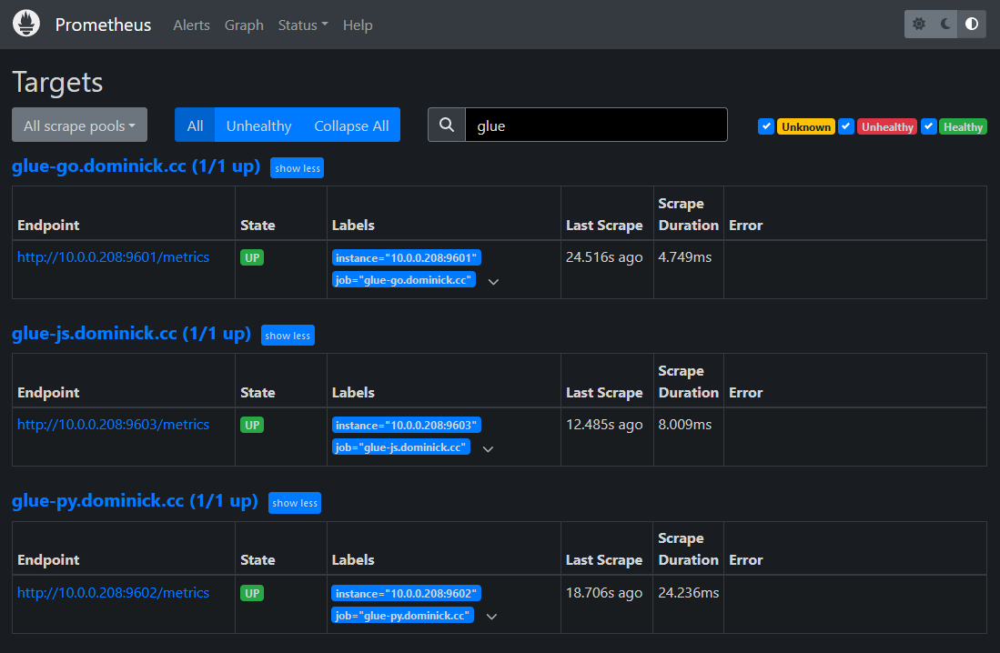

# Observability
Here's an overview of the observability I've built into these services I have deployed.

## API Monitoring
I've setup [Uptime Kuma](https://github.com/louislam/uptime-kuma) (a basic monitoring tool) to probe the API of each implementation every 5 minutes. I have it configured to email me when a probe fails after 2 retries. This instance is hosted within my Tailscale network, so it's not externally accessible -- so here is a screenshot:


## Prometheus Metrics and Grafana Dashboard
Within each implementation, I'm capturing the following metrics:

|Metric name|Type|Labels|
|---|---|---|
|`chan_boards_requested_total`|Counter|`board`|
|`total_request_seconds`|Histogram|`method`, `endpoint`, `response_code`|
|`fanout_request_seconds`|Histogram|`method`, `endpoint`, `response_code`|

`total_request_seconds` measures the ingress of traffic and `fanout_request_seconds` measures the egress. 

For now, I decided to serve the `/metrics` endpoint on the same port as the HTTP server, so the metrics are actually publically accessible (but that's not something I'd do for a real service):

```sh
curl https://glue-py.dominick.cc/metrics
curl https://glue-go.dominick.cc/metrics
curl https://glue-js.dominick.cc/metrics
```

Prometheus is setup as another container deployed in my OCI tenancy, and I've configured each of the instances above as scrape targets like so:



I've created a basic dashboard to show some of these metrics. Grafana is also only accessible within my Tailscale network, so here's a screenshot:


## Future work
Some things I could do in the future to improve this are:
- Host the `/metrics` endpoint on a different point, or otherwise block external access to that route.
- Gather logs and present them in a tool like Kibana.
- Create Prometheus alerts.
- Implement OpenTelemetry tracing.
