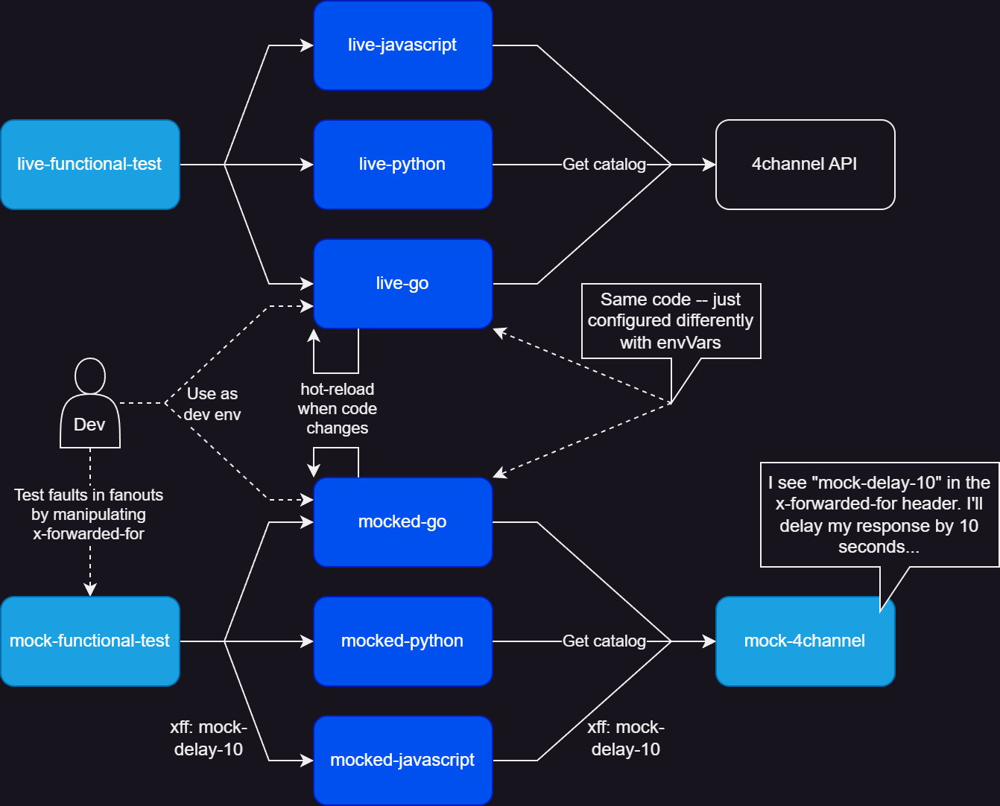
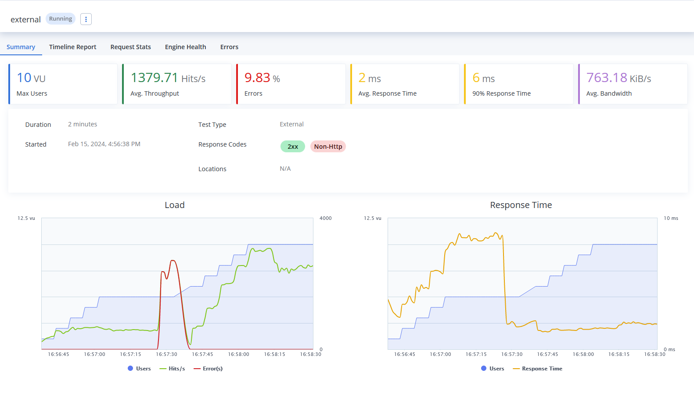
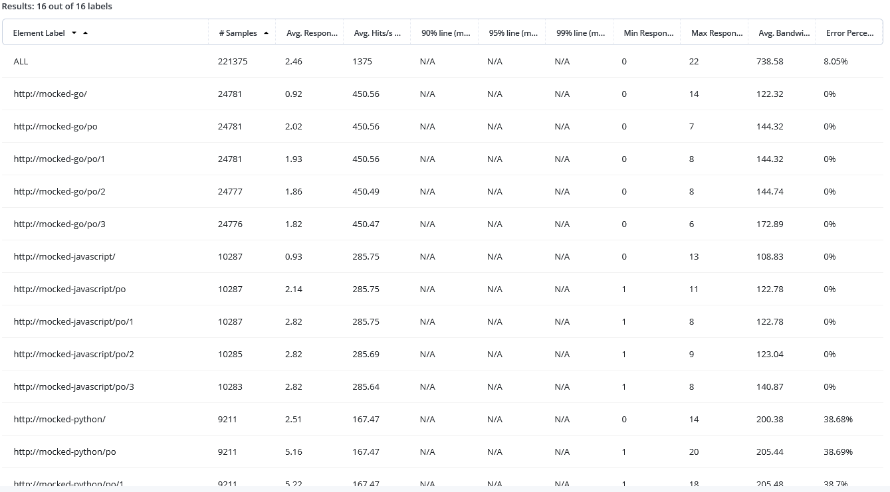
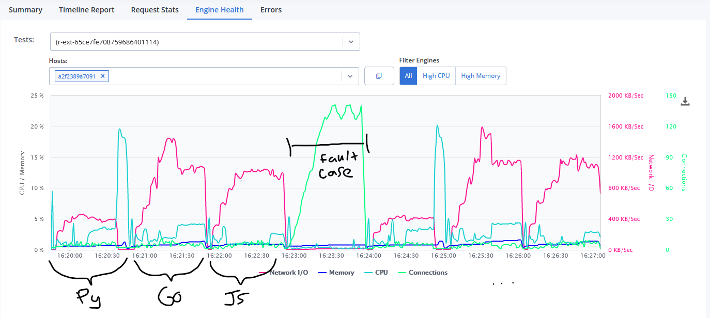
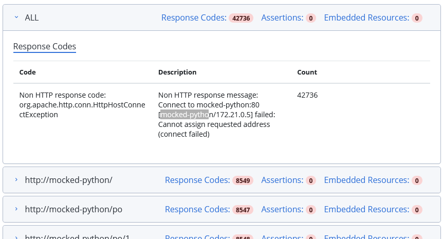

## Testing
### Unit testing
_Not yet implemented._
### Functional testing
This repo includes mock and live functional testing. Some people would instead use these terms: integration testing, API testing, component testing. Regardless, these are external tests of the API via HTTP requests. These types of tests are nice for a project like this because we can write one test and use it on all of the existing implementations (or future ones if I add more languages) since they should provide the exact same API. 

You can run the mock functional tests like this:
```sh
docker-compose up --build mock-functional-test
```



The live-functional-tests just do some very basic checks to ensure the live containers are appropriately configured for their dependencies. 

You can run the live functional tests like this:
```sh
docker-compose up --build live-functional-test
```

The majority of the logic is tested in the `mock-functional-test`, where we control everything that the fanout is doing. For example, we can mock out a specific set of data to be returned and write our tests against it. We won't have to worry about data changing in the live dependency that breaks out tests.

Furthermore, we can inject some faults into the system to see how our application reacts when encountering problems. The way I've done it here is to use (abuse?) the `X-Forwarded-For` (XFF) header, which is forwarded to the dependency so they can see the originating IP (sometimes this is required to support rate limiting when proxies are involved). I've configured my "mock-4channel" application to delay its response when it sees the XFF signal `4c-mock-delay=N` with "N" being the number of seconds to delay. This means, the person writing mock-functional-tests can just alter the XFF being sent into the application which allows them easily test the timeout logic.

These tests are also setup to run locally with [pytest-watch](https://pypi.org/project/pytest-watch/). When pytest-watch detects test code changes, it will automatically re-run the tests to reduce test iteration time.

## Performance testing
For performance tests, I'm using a tool called [Taurus](https://gettaurus.org/). Taurus acts like a wrapper for several different performance testing tools (e.g. JMeter, Locust, Gatling...) and it lets you configure test scenarios with [a simplified YAML DSL](../tests/performance/src/mock-perf-test.yml). 

Additionally, Taurus includes integration to [BlazeMeter](https://www.blazemeter.com/), which is a SaaS solution for performance testing. This is helpful because Taurus can also be configured to output BlazeMeter reports. The anonymous/free version doesn't last very long (something like 7 days). But the container outputs a URL to an interactive report that shows what is occurring as the test is underway.

You can run the mock performance test like so:
```
docker-compose up mock-performance-test
```

You should then see something like this in the container log output:
```txt
...
mock-performance-test-1  | 21:19:44 INFO: Starting...
mock-performance-test-1  | 21:19:44 INFO: Waiting for results...
mock-performance-test-1  | 21:19:44 INFO: Initiating data feeding...
mock-performance-test-1  | 21:19:45 INFO: Started data feeding: https://a.blazemeter.com/app/?public-token=UN81on78FhUAxSoy8XF2FA1Qzglsk1x0kCeujtrb0GIXvOziqT#reports/r-ext-65ce7fe708759686401114/summary
```

Clicking on that link (the exact one above will likely be dead by the time you read this), I can watch the results of the test as it's underway. Here's an example the report looks like for a running test:



The included mock functional test runs against the "mocked" versions of each implementation and lasts about 7 minutes. This is roughly what it does:

1. 1 minute positive case targeting `mocked-python`
1. 1 minute positive case targeting `mocked-go`
1. 1 minute positive case targeting `mocked-js`
1. 1 minute negative case targeting all 3 implementations
   - A signal is sent to `mock-4channel` to slow down it's responses
1. 1 minute positive case targeting `mocked-python`
1. 1 minute positive case targeting `mocked-go`
1. 1 minute positive case targeting `mocked-js`

This pattern of running best-case scenarios surrounging fault cases (a "💩🥪" if you will) can sometimes catch resource problems. Such as if memory usage increases during the dependency slowdown (which is expected) but is not released when the slowdown resolves (which would be bad).

### Results and takeaways

Looking at the request stats in the positive scenario, we can see that overall: Go was fastest (~450 tps), followed by Javascript (~285 tps), and then Python (~167 tps). Furthermore, about 38% of the Python requests failed. 



So why is Python so bad? Well, I'm using the Flask development server to serve it. I guess we now know why the Flask docs say this:
> Do not use the development server when deploying to production. It is intended for use only during local development. It is not designed to be particularly efficient, stable, or secure.

So to improve this, I'd serve it with something like Gunicorn and likely use a multiprocessing setup with gevent workers.

You might also notice in the table above that there are more samples (completed requests) that occured with Go. The performance tests employ a "virtual user" for concurrency which in our case is just a loop of the defined requests. Go was able to complete each request faster so it could move on to the next request sooner and got more work done in the same amount of time.

The engine health tab shows us some interesting data as well:



In the fault case, the number of connections held open increases as the number if virtual users is higher for this test case (I raised it because each request is so slow).

During the second half of the positive Python test case, the CPU spikes very high as the web server stops making connections which causes requests to end extremely quickly (which  results in a very rapid increase in the number of requests).

You can see the actual error that JMeter reported here:




## Local development and use

```sh
# Start the live container(s) locally
docker-compose up --build live-python       # python
docker-compose up --build live-go           # go
docker-compose up --build live-javascript   # javascript

# Start the mock container(s) locally
docker-compose up --build mocked-python       # python
docker-compose up --build mocked-go           # go
docker-compose up --build mocked-javascript   # javascript

# You can start everything like this if you don't want to specify them individually
docker-compose up --build
```
You will notice that after running these (or the `mocked-` versions), that any time you make a code change to the application source code, the process will reload. In the case of Go, we make use of [CompileDaemon](https://github.com/githubnemo/CompileDaemon) to also recompile the program when changes are detected. 

This means that each of these containers defined in [./docker-compose.yml](./docker-compose.yml) are also a defined development environment that supports "developing on-container". Setting up projects this way allows teams to work with multiple different languages, versions of languages, and runtimes. You don't have to worry about the version of Go or Node installed on your development machine -- the only real dependency is Docker and docker-compose. Additionally, this means that what you're running as you develop is extremely similar to what you're shipping (both are containers built the same way).

```sh
# View page 2 of Papercraft & Origami (/po/)
curl http://localhost:8001/po/2             # live-python
curl http://localhost:8002/po/2             # live-go
curl http://localhost:8003/po/2             # live-javascript
# Refer to the port configuration in ./docker-compose.yml
```